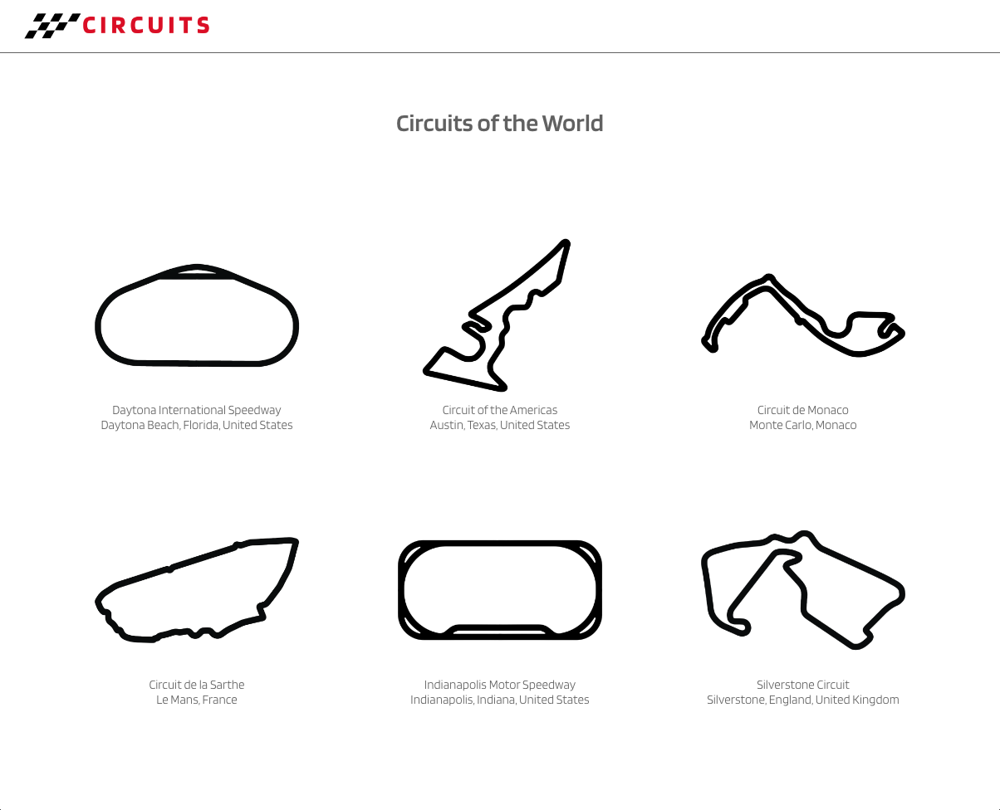
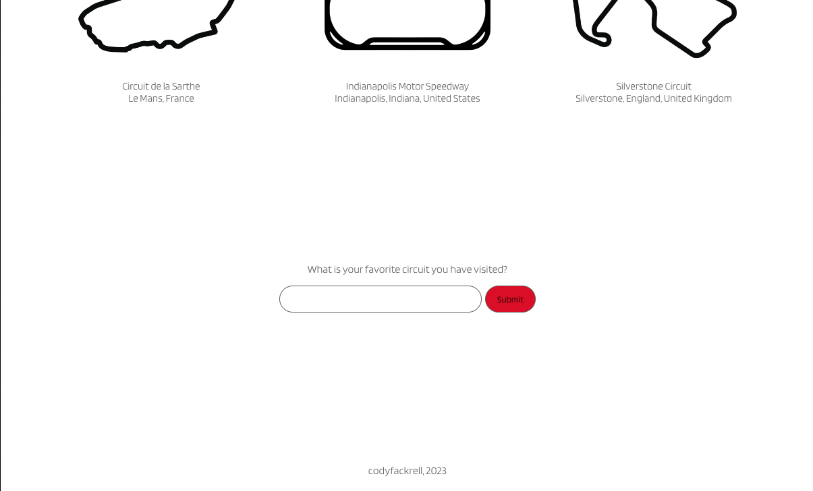
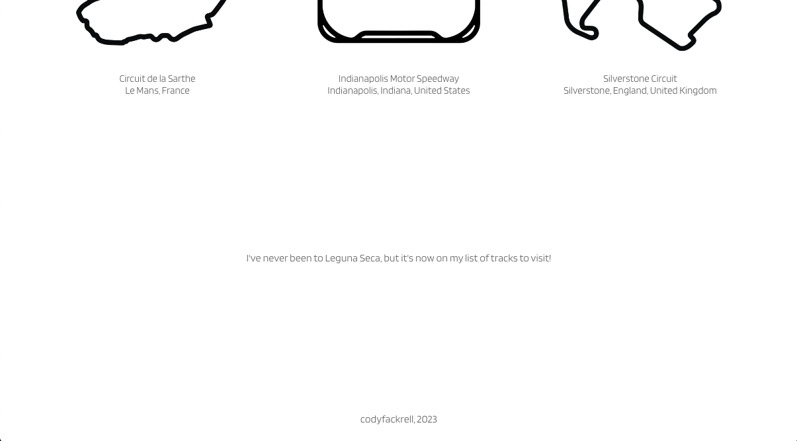
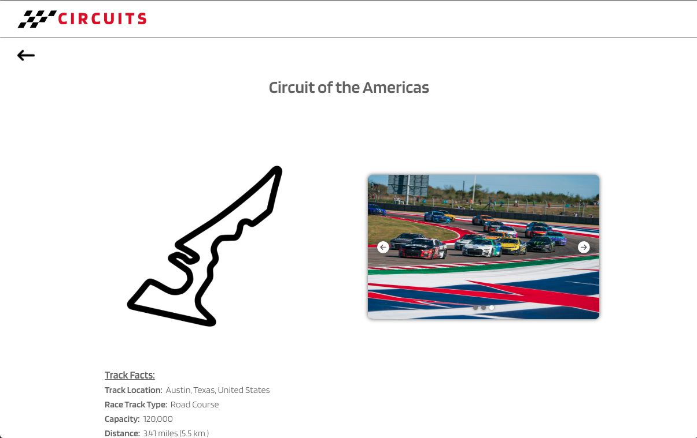
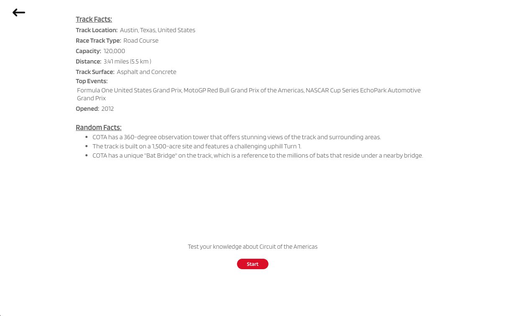
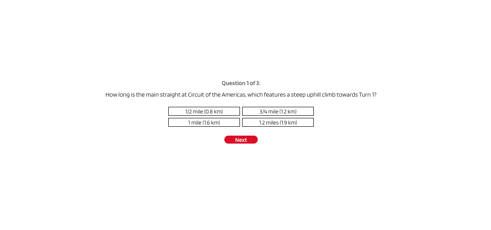

# *Circuits*

*Circuits* is a full-stack web application that helps racing novices or enthusiasts learn interesting facts and test their knowledge about some of the most popular race tracks in the world.

[Watch the demo](https://www.loom.com/share/6dcf3846d1a84c089f0c55ccef61ee9c)
 
[Learn more about the developer](https://www.linkedin.com/in/codyfackrell/)

Tech Stack:
* React
* Node.js
* Express.js
* PostgreSQL
* Sequelize
* HTML5/CSS

 

***Home Page View:***
 
 
 
 
 

 

***Track Page View:***

 

 

***Quiz on Track Page:***

 

