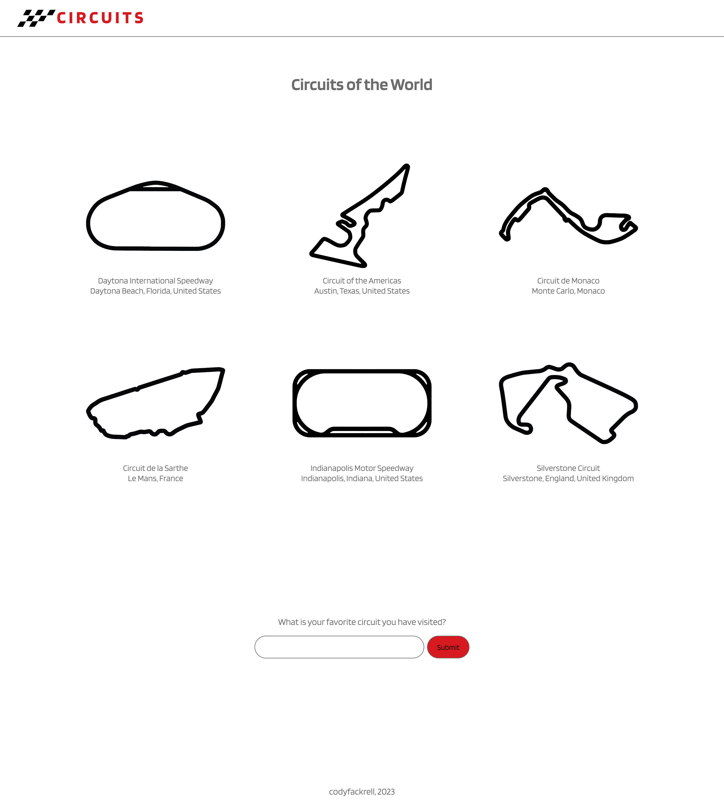
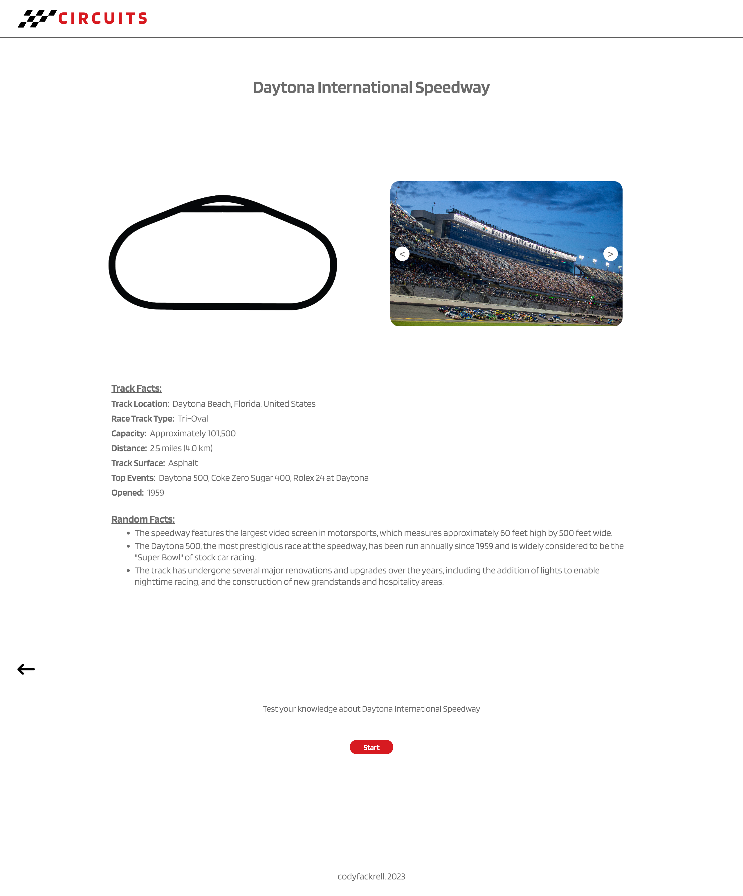

# *Circuits*

*Circuits* is a full-stack web application that helps racing novices or enthusiasts learn interesting facts and test their knowledge about some of the most popular race tracks in the world.

***Watch the demo:*** https://www.loom.com/share/6dcf3846d1a84c089f0c55ccef61ee9c
***Learn more about the developer:*** https://www.linkedin.com/in/codyfackrell/

Tech Stack:
* HTML5/CSS
* Javascript
* Node.js
* Express.js
* PostgreSQL
* Sequelize*

 

***Home Page View:***
 

 

***Track Page View:***

